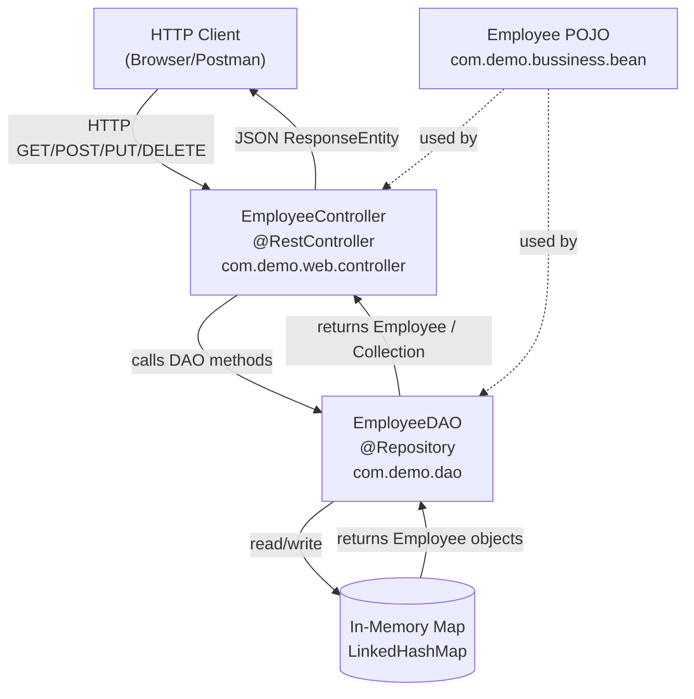
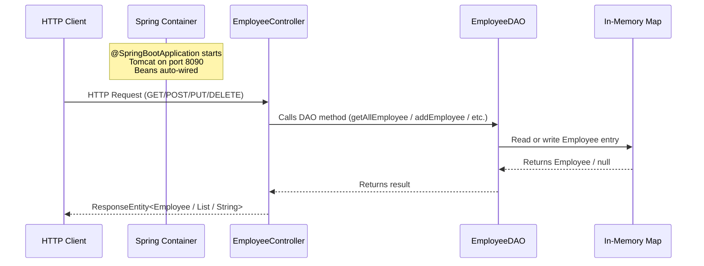

# D1 — Spring Boot Project Structure

## Project Overview

This demo project illustrates the **standard layered package structure** of a Spring Boot application. It exposes a fully functional **Employee REST API** (CRUD) backed by an in-memory data store, and is designed as a reference for how a Spring Boot project should be organized across `web`, `business`, and `dao` layers.

---

## Prerequisites

| Tool | Minimum Version |
|------|----------------|
| Java JDK | 21 |
| Apache Maven | 3.9+ |
| IDE (optional) | IntelliJ IDEA / Eclipse / VS Code |

---

## Technology Stack

| Technology | Version | Purpose |
|------------|---------|---------|
| Java | 21 | Programming language |
| Spring Boot | 3.5.7 | Application framework |
| Spring Web (Embedded Tomcat) | (managed by Boot) | REST API + HTTP server |
| spring-boot-maven-plugin | (managed by Boot) | Build executable JAR |
| Maven | 3.9+ | Build tool |

---

## Architecture

The application follows a **three-layer architecture**:

```
┌──────────────────────────────────┐
│         HTTP Client              │
│  (Browser / Postman / curl)      │
└────────────┬─────────────────────┘
             │ HTTP Request
             ▼
┌──────────────────────────────────┐
│        Web Layer                 │
│   EmployeeController             │  ← com.demo.web.controller
│   (@RestController)              │
└────────────┬─────────────────────┘
             │ Method calls
             ▼
┌──────────────────────────────────┐
│       DAO Layer                  │
│   EmployeeDAO                    │  ← com.demo.dao
│   (@Repository)                  │
└────────────┬─────────────────────┘
             │ In-memory Map
             ▼
┌──────────────────────────────────┐
│       Business / Bean Layer      │
│   Employee (POJO)                │  ← com.demo.bussiness.bean
└──────────────────────────────────┘
```

### Package Layout

```
src/main/java/com/demo/
├── Application.java                  ← @SpringBootApplication entry point
├── web/
│   └── controller/
│       └── EmployeeController.java   ← REST endpoints
├── bussiness/
│   └── bean/
│       └── Employee.java             ← Domain model (POJO)
└── dao/
    └── EmployeeDAO.java              ← In-memory data store (@Repository)

src/main/resources/
└── application.properties            ← server.port = 8090
```

---

## Architecture Flow Diagram



---

## Application Flow Diagram



---

## Execution Steps

### 1. Clone / Navigate to project

```bash
cd D1_SB_Project_Structure
```

### 2. Build

```bash
mvn clean package -DskipTests
```

### 3. Run

**Option A — Maven**
```bash
mvn spring-boot:run
```

**Option B — JAR**
```bash
java -jar target/D1_SB_Project_Structure-0.0.1-SNAPSHOT.jar
```

### 4. Verify startup

Look for the log line:
```
Tomcat started on port 8090 (http) with context path '/'
```

---

## All Endpoints

Base URL: `http://localhost:8090`

| # | Method | Endpoint | Description | Request Body | Response |
|---|--------|----------|-------------|--------------|----------|
| 1 | GET | `/emp/controller/getDetails` | Get all employees | None | `200 OK` — JSON array |
| 2 | GET | `/emp/controller/getDetailsById/{id}` | Get employee by ID | None | `200 OK` / `404 Not Found` |
| 3 | POST | `/emp/controller/addEmp` | Add new employee | JSON Employee | `201 Created` — text/html |
| 4 | PUT | `/emp/controller/updateEmp` | Update existing employee | JSON Employee | `200 OK` / `500` if not found |
| 5 | DELETE | `/emp/controller/deleteEmp/{id}` | Delete employee by ID | None | `200 OK` / `500` if not found |

---

## Sample Data & Payloads

### Pre-seeded Data (available at startup)

| employeeId | employeeName | salary | departmentCode |
|------------|-------------|--------|----------------|
| 10001 | Jack | 12345.6 | 1001 |
| 10002 | Justin | 12355.6 | 1002 |
| 10003 | Eric | 12445.6 | 1003 |

---

### 1. GET All Employees

**Request**
```http
GET http://localhost:8090/emp/controller/getDetails
```

**Response `200 OK`**
```json
[
  { "employeeName": "Jack",   "employeeId": 10001, "salary": 12345.6, "departmentCode": 1001 },
  { "employeeName": "Justin", "employeeId": 10002, "salary": 12355.6, "departmentCode": 1002 },
  { "employeeName": "Eric",   "employeeId": 10003, "salary": 12445.6, "departmentCode": 1003 }
]
```

---

### 2. GET Employee by ID

**Request**
```http
GET http://localhost:8090/emp/controller/getDetailsById/10001
```

**Response `200 OK`**
```json
{ "employeeName": "Jack", "employeeId": 10001, "salary": 12345.6, "departmentCode": 1001 }
```

**Not Found Response `404`**
```http
GET http://localhost:8090/emp/controller/getDetailsById/99999
```
```
(empty body, HTTP 404)
```

---

### 3. POST Add Employee

**Request**
```http
POST http://localhost:8090/emp/controller/addEmp
Content-Type: application/json
```
```json
{ "employeeName": "Alice", "salary": 50000.0, "departmentCode": 1004 }
```

**Response `201 Created`**
```
Employee added successfully with id:10005
```
> `employeeId` is auto-assigned (starts from 10004, increments per request).

---

### 4. PUT Update Employee

**Request**
```http
PUT http://localhost:8090/emp/controller/updateEmp
Content-Type: application/json
```
```json
{ "employeeName": "Jack Updated", "employeeId": 10001, "salary": 75000.0, "departmentCode": 1001 }
```

**Response `200 OK`**
```json
{ "employeeName": "Jack Updated", "employeeId": 10001, "salary": 75000.0, "departmentCode": 1001 }
```

**Employee Not Found Response `500`**
```json
null
```

---

### 5. DELETE Employee by ID

**Request**
```http
DELETE http://localhost:8090/emp/controller/deleteEmp/10003
```

**Response `200 OK`**
```json
{ "employeeName": "Eric", "employeeId": 10003, "salary": 12445.6, "departmentCode": 1003 }
```

**Employee Not Found Response `500`**
```json
null
```
